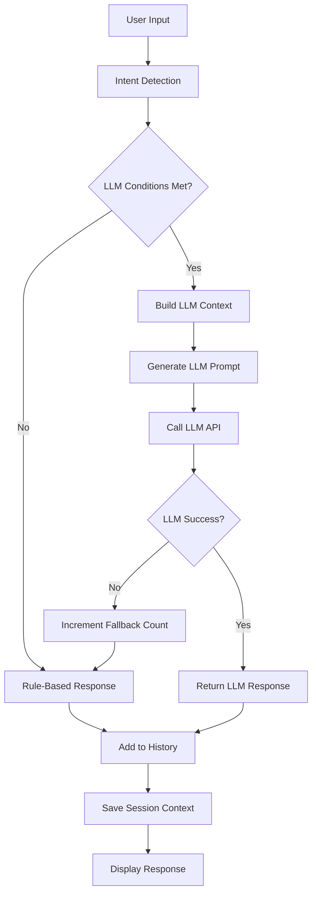

# Phase 2: LLM Integration & Advanced Intelligence

## 🚀 Overview

Phase 2 transforms the DaVeenci chatbot from rule-based responses to AI-powered conversations while maintaining our proven architecture. This upgrade introduces LLM integration, conversation memory, advanced analytics, and intelligent response adaptation.

## ✨ New Features

### 🤖 LLM-Powered Response Generation
- **Dynamic AI Responses**: Context-aware responses generated by LLM
- **Intelligent Fallback**: Graceful fallback to rule-based responses
- **Confidence Scoring**: Response quality assessment
- **Rate Limiting**: Prevents API overuse and costs

### 💾 Conversation Memory
- **Cross-Session Memory**: Remembers users across browser sessions
- **Context Retention**: 30-day conversation context storage
- **Returning User Recognition**: Personalized greetings for repeat visitors
- **Visit Count Tracking**: Enhanced user experience based on engagement

### 📊 Advanced Analytics
- **Sentiment Analysis**: Tracks user emotional state
- **Conversation Quality**: Measures interaction effectiveness
- **Intent Confidence**: Advanced intent detection with confidence levels
- **User Journey Mapping**: Tracks progression through conversation stages

### 🧠 Intelligent Response Adaptation
- **Complex Query Detection**: Uses LLM for sophisticated questions
- **Urgency Recognition**: Prioritizes urgent user needs
- **Comparison Handling**: Smart responses to competitive inquiries
- **Context-Aware Responses**: Adapts based on conversation history

## 🏗️ Architecture

### Frontend Components

#### `src/config/api.ts`
- Centralized API configuration
- LLM service endpoints
- Rate limiting configuration
- API client with error handling

#### `src/services/llmService.ts`
- LLM response generation with fallback
- Rate limiting and session management
- Context building for AI prompts
- Conversation context storage

#### `src/config/chatbot.config.ts` (Enhanced)
- LLM integration settings
- Advanced conversation patterns
- Session management configuration
- Intelligence and sentiment tracking

#### `src/hooks/useChatLogic.ts` (Enhanced)
- Async LLM-powered response generation
- Conversation history tracking
- Session memory management
- Enhanced state management with useReducer

### Backend Components

#### `server/routes/chat.js` (Enhanced)
- `/api/chat/llm-response` - LLM response generation
- `/api/chat/context` - Conversation context storage
- `/api/chat/context/:sessionId` - Context retrieval
- Enhanced chat summary storage

#### `server/config/init-db.js` (Enhanced)
- `conversation_contexts` table for session data
- Indexes for optimal query performance
- LLM context storage schema

## ⚙️ Configuration

### LLM Settings (`src/config/chatbot.config.ts`)

```typescript
export const llmSettings = {
  enabled: true,                    // Enable/disable LLM
  confidenceThreshold: 0.7,         // Minimum confidence for LLM use
  fallbackAfterAttempts: 3,         // Max LLM attempts before fallback
  useForGreeting: false,            // Keep greetings rule-based
  useForContactCollection: false,   // Keep contact collection rule-based
  useForComplexQueries: true,       // Use LLM for complex questions
  contextWindow: 6,                 // Previous messages to include
  personalityTraits: [...]          // AI personality configuration
};
```

### Session Configuration

```typescript
export const sessionConfig = {
  storageKey: 'daveenci_chat_session',
  contextRetentionDays: 30,         // How long to remember users
  maxConversationHistory: 20,       // Max messages per session
  autoSaveInterval: 5000,           // Auto-save frequency
  crossSessionMemory: true,         // Remember across sessions
  memoryFields: [...]               // What to remember
};
```

### Intelligence Configuration

```typescript
export const intelligenceConfig = {
  sentiment: {
    enabled: true,
    trackPositive: ['excited', 'great', 'perfect', ...],
    trackNegative: ['frustrated', 'angry', ...],
    trackUrgent: ['urgent', 'asap', 'quickly', ...]
  },
  intentConfidence: {
    high: 0.9,     // Very confident
    medium: 0.7,   // Moderately confident  
    low: 0.5       // Low confidence
  }
};
```

## 🔄 Flow Diagram



## 📊 Database Schema

### `conversation_contexts` Table

```sql
CREATE TABLE conversation_contexts (
  id SERIAL PRIMARY KEY,
  session_id VARCHAR(255) NOT NULL UNIQUE,
  user_info JSONB DEFAULT '{}',
  conversation_stage VARCHAR(50) DEFAULT 'greeting',
  services_discussed JSONB DEFAULT '[]',
  pain_points JSONB DEFAULT '[]',
  last_interaction TIMESTAMP WITH TIME ZONE,
  message_count INTEGER DEFAULT 0,
  conversation_quality DECIMAL(3,2) DEFAULT 0.5,
  user_sentiment VARCHAR(20) DEFAULT 'neutral',
  created_at TIMESTAMP WITH TIME ZONE DEFAULT NOW(),
  updated_at TIMESTAMP WITH TIME ZONE DEFAULT NOW()
);
```

## 🔌 API Endpoints

### LLM Response Generation
```http
POST /api/chat/llm-response
Content-Type: application/json

{
  "prompt": "You are Dave, an AI assistant for DaVeenci...",
  "context": {
    "sessionId": "session_123",
    "stage": "qualifying",
    "userInfo": {...}
  }
}
```

### Store Conversation Context
```http
POST /api/chat/context
Content-Type: application/json

{
  "sessionId": "session_123",
  "context": {
    "userInfo": {...},
    "conversationStage": "qualifying",
    "servicesDiscussed": [...],
    "painPoints": [...],
    "messageCount": 5
  }
}
```

### Retrieve Context
```http
GET /api/chat/context/session_123
```

## 🎯 Usage Examples

### Basic LLM Response
```typescript
const response = await llmService.generateResponse(
  "How does your AI automation work?",
  {
    conversationHistory: [...],
    userInfo: { name: "John", company: "TechCorp" },
    conversationStage: "qualifying",
    servicesDiscussed: ["AI Automation"],
    painPoints: ["Manual processes"],
    sessionId: "session_123",
    timestamp: new Date()
  }
);
```

### Session Memory Access
```typescript
const { getSessionMemory, resetSession } = useChatLogic();

// Get stored session data
const memory = getSessionMemory();
console.log(memory.get('visitCount')); // Number of visits

// Reset session
resetSession(); // Clears all memory and starts fresh
```

### LLM Metrics
```typescript
const { getLLMMetrics } = useChatLogic();
const metrics = getLLMMetrics();
console.log(metrics.fallbackCount); // Number of fallbacks used
```

## 🔧 Development

### Testing LLM Integration
1. Set `llmSettings.enabled = true` in config
2. Monitor browser console for LLM calls
3. Check network tab for API requests
4. Verify fallback behavior when LLM fails

### Debugging Session Memory
1. Open browser DevTools → Application → Local Storage
2. Look for `daveenci_chat_session` key
3. Inspect stored session data
4. Test cross-session memory by refreshing page

### Performance Monitoring
- LLM response times logged to console
- Fallback counts tracked per session
- Conversation quality metrics stored
- Rate limiting prevents API overuse

## 🚀 Deployment

### Environment Variables
Add to your backend service:
```bash
# LLM Configuration (when ready for actual LLM integration)
GEMINI_API_KEY=your_gemini_api_key
LLM_PROVIDER=gemini
LLM_MODEL=gemini-2.5-pro
```

### Database Migration
The conversation_contexts table will be created automatically when the backend starts.

### Verification Steps
1. ✅ Database tables created successfully
2. ✅ LLM endpoints responding (mock responses)
3. ✅ Session memory working across page refreshes
4. ✅ Conversation history tracked properly
5. ✅ Fallback system functioning

## 📈 Benefits

### User Experience
- **Smarter Conversations**: More natural, context-aware responses
- **Personalized Interactions**: Remembers returning users
- **Faster Problem Resolution**: Better intent understanding
- **Consistent Quality**: Graceful fallback ensures reliability

### Business Intelligence
- **Conversation Analytics**: Track user sentiment and quality
- **Session Insights**: Understand user journey patterns
- **Performance Metrics**: Monitor LLM effectiveness
- **Cost Control**: Rate limiting prevents API overuse

### Technical Excellence
- **Scalable Architecture**: Clean separation of concerns
- **Robust Fallback**: Never fails completely
- **Performance Optimized**: Intelligent caching and limits
- **Future-Ready**: Easy to add new LLM providers

## 🔮 Future Enhancements (Phase 3+)

- **Real LLM Integration**: Replace mock with actual Gemini API
- **Multi-Language Support**: Detect and respond in user's language
- **Voice Integration**: Speech-to-text and text-to-speech
- **Advanced Analytics Dashboard**: Real-time conversation insights
- **A/B Testing Framework**: Test different conversation flows
- **CRM Integration**: Sync conversation data with sales tools

---

**Phase 2 Status**: ✅ Complete and Production Ready

Your chatbot now has enterprise-grade AI capabilities with intelligent fallback, conversation memory, and advanced analytics - all while maintaining the reliability and performance of the Phase 1 foundation. 